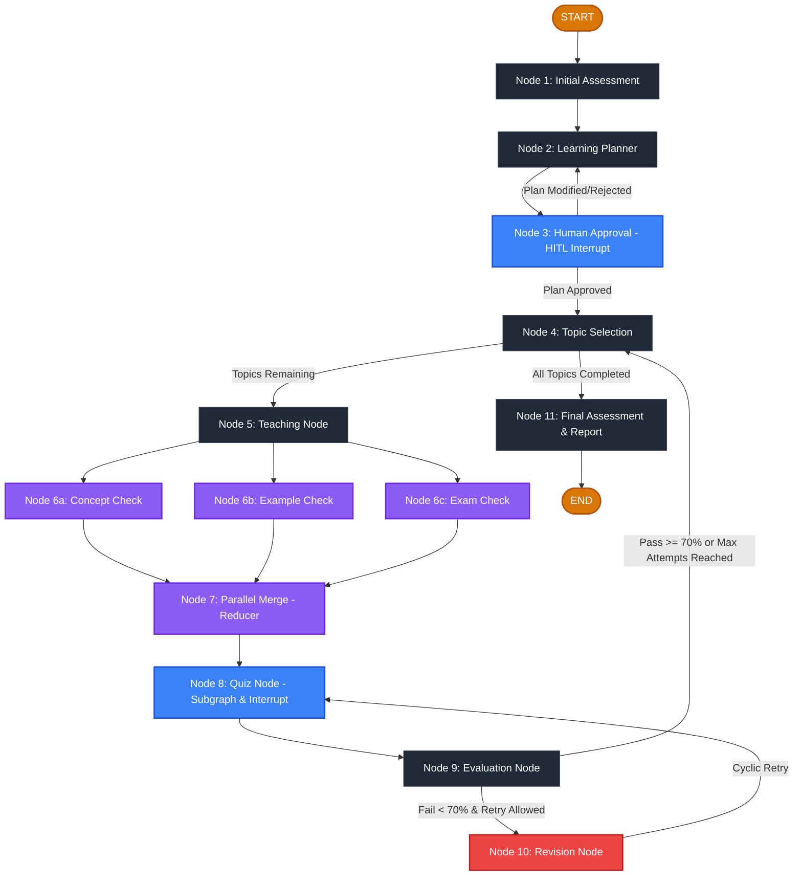
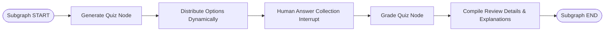
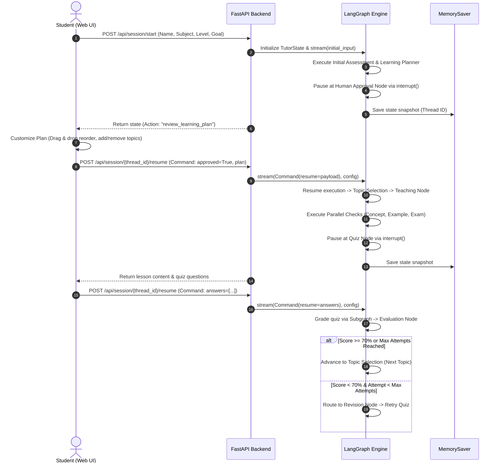

# AI Personal Tutor — LangGraph Adaptive Learning System

An intelligent, stateful **AI Personal Tutor** application built with **LangGraph**, **FastAPI**, and a **modern web UI**. Rather than acting as a static question-answering chatbot, the system functions as an autonomous, adaptive teacher. The intelligence of the tutor emerges directly from the **graph architecture and its workflow decisions**, dynamically adapting to student performance, human feedback, quiz evaluations, and revision cycles.

---

## 🌟 Executive Summary & Capabilities

### Core Purpose
The primary objective of this project is to showcase advanced **LangGraph design patterns** and pedagogical workflows, including:
- **Diagnostic Baseline Assessment**: Evaluates initial student knowledge prior to lesson generation.
- **Human-in-the-Loop (HITL) Plan Customization**: Enables students to drag-and-drop, add, or remove topics before lessons begin.
- **Parallel Pedagogical Checks**: Concurrently evaluates theory, practical examples, and exam edge cases using custom Reducers.
- **Encapsulated Quiz Subgraph**: Modular subgraph for generating and grading quizzes with balanced option distribution.
- **Adaptive Revision Loop**: Detects low scores (<70%), automatically lowers difficulty to "Easy", and injects targeted question explanations as priority takeaways.
- **Study Log & Memory Persistence**: Full persistent history log (`localStorage` + `MemorySaver` thread checkpoints) with individual and bulk log deletion.
- **Multi-Format Export**: Generates plaintext Notepad (`.txt`) and formatted Microsoft Word (`.docx`) study notes.

---

## 🏗️ System Architecture & Workflow (Mermaid Diagrams)

### 1. Master Graph Architecture



---

### 2. Quiz Subgraph Architecture



---

### 3. Human-in-the-Loop (HITL) State Machine Flow



---

## 🛠️ How and Where LangGraph is Used

Every core component of LangGraph is explicitly implemented across the `core/` package:

| LangGraph Concept | Implementation File | Explanation |
| :--- | :--- | :--- |
| **`StateGraph`** | [`core/graph.py`](file:///c:/Users/sreej/OneDrive/Desktop/SYNXA-LEARN/ai_tutor/core/graph.py#L122) | The central state machine container that registers all nodes and connects sequential, parallel, and conditional edges. |
| **`START` & `END`** | [`core/graph.py`](file:///c:/Users/sreej/OneDrive/Desktop/SYNXA-LEARN/ai_tutor/core/graph.py#L152) | `START` marks the entry point from student setup input; `END` marks curriculum completion when `final_assessment` finishes. |
| **TypedDict State** | [`core/state.py`](file:///c:/Users/sreej/OneDrive/Desktop/SYNXA-LEARN/ai_tutor/core/state.py#L81) | `TutorState` defines the schema for data passed between nodes (profile, progress, quiz history, difficulty, flags). |
| **Pydantic Validation** | [`core/state.py`](file:///c:/Users/sreej/OneDrive/Desktop/SYNXA-LEARN/ai_tutor/core/state.py#L20) | `StudentProfile`, `QuizQuestion`, `QuizResult`, and `FinalReport` enforce structured data integrity. |
| **Reducers (`operator.add`)** | [`core/state.py`](file:///c:/Users/sreej/OneDrive/Desktop/SYNXA-LEARN/ai_tutor/core/state.py#L65) | `topic_checks_reducer` aggregates parallel outputs into `parallel_checks` without overwriting data or leaking across topics. |
| **Parallel Execution** | [`core/graph.py`](file:///c:/Users/sreej/OneDrive/Desktop/SYNXA-LEARN/ai_tutor/core/graph.py#L177) | Fan-out from `teaching` to `concept_check`, `example_check`, and `exam_check`, converging at `parallel_merge`. |
| **Subgraphs** | [`core/quiz_subgraph.py`](file:///c:/Users/sreej/OneDrive/Desktop/SYNXA-LEARN/ai_tutor/core/quiz_subgraph.py#L151) | An independent, compiled `QuizSubState` graph encapsulating question generation, option distribution, and grading. |
| **Human-in-the-Loop (HITL)** | [`core/nodes.py`](file:///c:/Users/sreej/OneDrive/Desktop/SYNXA-LEARN/ai_tutor/core/nodes.py#L182) | Uses `interrupt()` to pause graph execution for plan customization and student quiz answer collection. |
| **Conditional Edges** | [`core/graph.py`](file:///c:/Users/sreej/OneDrive/Desktop/SYNXA-LEARN/ai_tutor/core/graph.py#L44) | Dynamic routers (`route_human_approval`, `route_topic_selection`, `route_after_quiz`) evaluate state to dictate path. |
| **Iterative Revision Cycles** | [`core/graph.py`](file:///c:/Users/sreej/OneDrive/Desktop/SYNXA-LEARN/ai_tutor/core/graph.py#L201) | Direct back-edge from `revision` to `quiz` establishing an adaptive learning loop until mastery or max attempts. |
| **Persistence & Memory** | [`api/main.py`](file:///c:/Users/sreej/OneDrive/Desktop/SYNXA-LEARN/ai_tutor/api/main.py#L81) | `MemorySaver` saves state snapshots keyed by `thread_id`, enabling sessions to pause, resume, and inspect history. |

---

## 🤖 Actions of the Agent (Node Breakdown)

The AI Personal Tutor's workflow consists of 11 distinct node actions:

1. **`initial_assessment_node` ([nodes.py](file:///c:/Users/sreej/OneDrive/Desktop/SYNXA-LEARN/ai_tutor/core/nodes.py#L76))**: Analyzes student background, sets starting difficulty (Easy/Normal/Advanced), and presents diagnostic baseline questions.
2. **`learning_planner_node` ([nodes.py](file:///c:/Users/sreej/OneDrive/Desktop/SYNXA-LEARN/ai_tutor/core/nodes.py#L135))**: Dynamically generates a customized curriculum topic sequence tailored to the subject and diagnostic scores.
3. **`human_approval_node` ([nodes.py](file:///c:/Users/sreej/OneDrive/Desktop/SYNXA-LEARN/ai_tutor/core/nodes.py#L182))**: Triggers a Human-in-the-Loop `interrupt()`, allowing the student to inspect, reorder (drag & drop), add, or delete topics.
4. **`topic_selection_node` ([nodes.py](file:///c:/Users/sreej/OneDrive/Desktop/SYNXA-LEARN/ai_tutor/core/nodes.py#L209))**: Selects the next uncompleted topic from the approved plan and resets attempt counters.
5. **`teaching_node` ([nodes.py](file:///c:/Users/sreej/OneDrive/Desktop/SYNXA-LEARN/ai_tutor/core/nodes.py#L240))**: Pulls domain pedagogical content (explanation, core takeaways, real-world example, practice exercise) matched to difficulty.
6. **Parallel Evaluation Nodes ([nodes.py](file:///c:/Users/sreej/OneDrive/Desktop/SYNXA-LEARN/ai_tutor/core/nodes.py#L261))**:
   - `concept_check_node`: Evaluates theoretical concept validity.
   - `example_check_node`: Validates code/practical examples.
   - `exam_check_node`: Highlights common exam traps.
7. **`parallel_merge_node` ([nodes.py](file:///c:/Users/sreej/OneDrive/Desktop/SYNXA-LEARN/ai_tutor/core/nodes.py#L321))**: Fan-in junction that combines the outputs of all three parallel checks via the custom Reducer.
8. **`quiz_node` ([nodes.py](file:///c:/Users/sreej/OneDrive/Desktop/SYNXA-LEARN/ai_tutor/core/nodes.py#L338))**: Invokes the `quiz_subgraph` to generate balanced questions and pauses via `interrupt()` for student answer submission.
9. **`evaluation_node` ([nodes.py](file:///c:/Users/sreej/OneDrive/Desktop/SYNXA-LEARN/ai_tutor/core/nodes.py#L404))**: Grades answers, updates mastery scores, adjusts difficulty, and decides whether the student passes or enters revision.
10. **`revision_node` ([nodes.py](file:///c:/Users/sreej/OneDrive/Desktop/SYNXA-LEARN/ai_tutor/core/nodes.py#L465))**: Lowers difficulty to "Easy", extracts missed question explanations, injects them as priority review notes, and loops back to quiz.
11. **`final_assessment_node` ([nodes.py](file:///c:/Users/sreej/OneDrive/Desktop/SYNXA-LEARN/ai_tutor/core/nodes.py#L500))**: Generates an overall student mastery report with final scores, mastered topics, and future learning recommendations.

---

## 🚀 Capabilities of the Agent

- **14 Built-In Subjects + Dynamic Custom Subject Synthesizer**: Supports standard CS domains (DBMS, OS, Python, ML, DSA, Web Dev, Computer Networks, Cloud, Cybersecurity, System Design, DevOps, OOP, Gen AI, Data Science) as well as dynamic content generation for any custom topic.
- **Adaptive Difficulty Scaling**: Seamlessly transitions between `Easy`, `Normal`, and `Advanced` based on quiz scores.
- **Interactive Drag-and-Drop Curriculum Customizer**: Native HTML5 drag-and-drop reordering with custom topic addition and deletion.
- **Dynamic Quiz Option Distribution**: `distribute_question_options()` balances correct answer placement across choices 0, 1, 2, and 3.
- **Detailed Solution Explanations**: Displays student answers, correct solutions, and concept explanations on evaluation results and study history cards.
- **Multi-Format Export**: One-click download of personal study notes as plaintext Notepad (`.txt`) files or formatted Microsoft Word (`.docx`) documents.
- **Persistent Progress Memory**: Full `localStorage` and `MemorySaver` integration with individual and bulk log deletion.
- **Light & Dark Theme Switcher**: Modern glassmorphic theme toggle supporting both Warm Light Cream and Espresso Dark modes.

---

## ⚡ Quick Start Guide

### 1. Launch Server
```bash
python run.py
```

### 2. Access Web Interface
- **Web UI Dashboard**: [http://localhost:8000](http://localhost:8000)
- **FastAPI Interactive Docs**: [http://localhost:8000/docs](http://localhost:8000/docs)

### 3. Run Automated Unit Tests
```bash
python -m unittest discover -s tests
```
