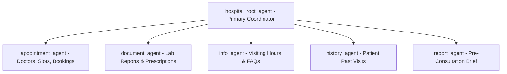
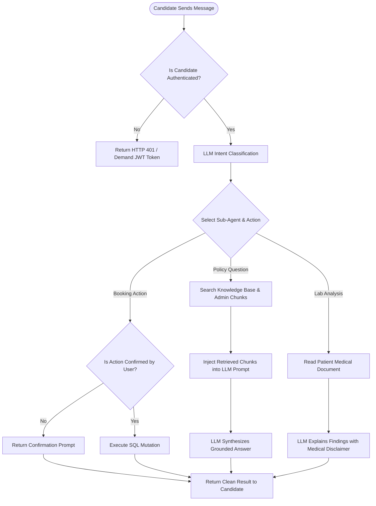
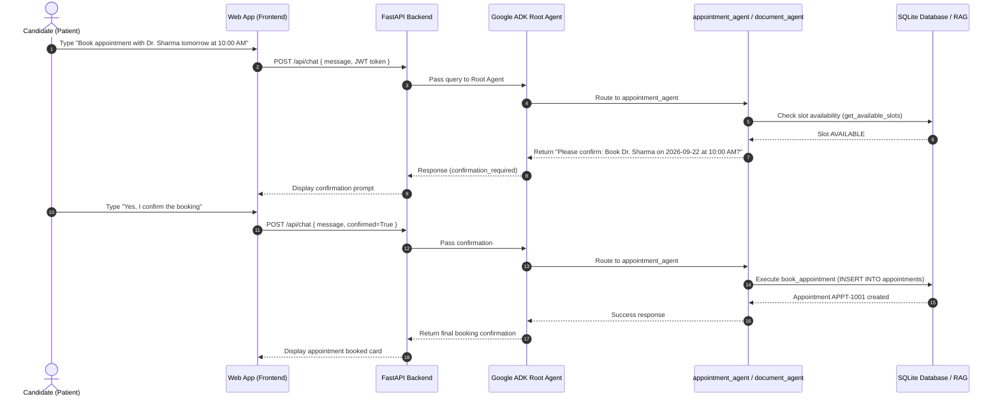
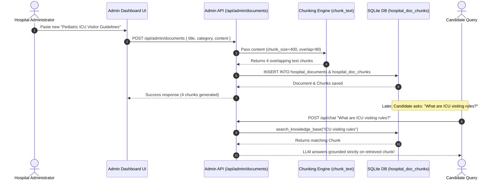
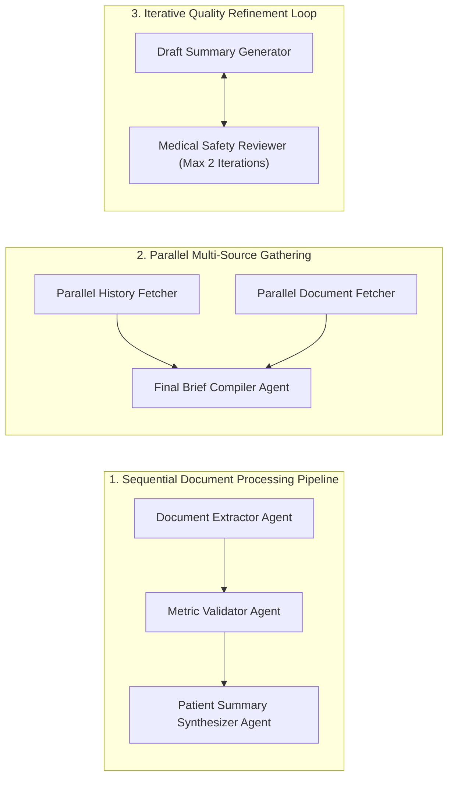
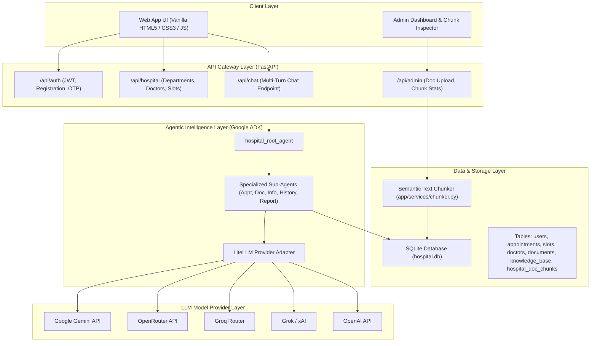
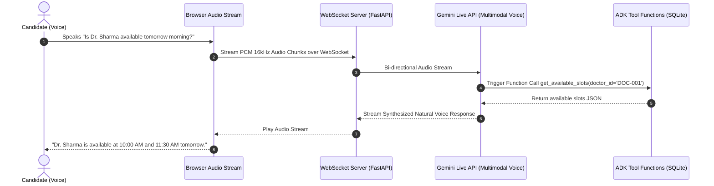

# 🏥 ApolloCare Smart Hospital AI Assistant — Project & Architecture Documentation

> **Project Overview**: ApolloCare is an enterprise-grade, conversational multi-agent healthcare operating assistant powered by **Google ADK (Agent Development Kit)**, **FastAPI**, **SQLite RAG**, and **LiteLLM**. It dynamically supports **any LLM Provider and API key** (OpenRouter, Gemini, Groq, Grok/xAI, OpenAI, Anthropic, DeepSeek, etc.) configured via environment variables without code changes.

---

## 📌 1. Problem Statement

Modern healthcare navigation is fragmented, inefficient, and stressful for candidates (patients) and hospital administrators alike:

- ⏳ **Long Phone Waiting Times**: Outpatients spend 15–30 minutes on phone holds just to check doctor availability or book/reschedule appointment slots.
- 📋 **Patient Medical Paperwork Overload**: Patients receive complex lab reports (e.g. Complete Blood Count, Serum IgE) filled with medical jargon that they cannot easily interpret before seeing a doctor.
- 📑 **Unprepared Doctor Consultations**: Doctors have limited 10–15 minute consultation windows, but patients often forget their past medical history or fail to summarize their recent test results.
- 🏥 **Outdated Hospital Knowledge Bases**: Hospital policies (visiting hours, ICU guidelines, emergency trauma rules) change frequently. Admins lack a simple tool to upload new guidelines that immediately inform AI assistants without expensive model fine-tuning.

---

## 💡 2. Solution: ApolloCare Smart Hospital AI

**ApolloCare** solves these challenges by combining **Multi-Agent Orchestration**, **Structured SQL Database Tool Execution**, **Semantic Document Chunking RAG**, and **Dynamic Multi-Provider LLM Integration**:

1. **Multi-Agent Orchestration (Google ADK)**: A coordinator agent (`root_agent`) routes queries to specialized sub-agents (`appointment_agent`, `document_agent`, `info_agent`, `history_agent`, `report_agent`).
2. **Safety Confirmation Guardrails**: Actionable operations (booking, canceling, rescheduling) require explicit user confirmation (`confirmed=True`) before mutating database records.
3. **Dynamic LLM Multi-Provider System**: Uses LiteLLM to accept any LLM provider & API key in `.env` (Gemini, OpenRouter, Groq, Grok, OpenAI, Anthropic) with zero code modifications.
4. **Admin Dashboard & RAG Chunking Engine**: Hospital Admins can upload policy documents. The backend automatically applies sliding-window text chunking (400 chars, 80 char overlap) and indexes chunks into the RAG vector search engine instantly.

---

## 🤖 3. Agents & Their Specialized Capabilities

| Agent Name | Primary Role & Responsibilities | Available Tools |
| :--- | :--- | :--- |
| **`hospital_root_agent`** | Primary conversational coordinator; greets candidates and routes intent to sub-agents. | Sub-agent delegation |
| **`appointment_agent`** | Specialist in department lookups, finding doctors, checking slot availability, and managing bookings with safety confirmation guardrails. | `search_departments`, `search_doctors`, `get_available_slots`, `book_appointment`, `cancel_appointment`, `reschedule_appointment` |
| **`document_agent`** | Inspects, extracts, and explains authorized medical lab reports, prescriptions, and test metrics safely. | `get_patient_documents`, `read_document` |
| **`info_agent`** | Answers general hospital questions, visiting hours, locations, and emergency directions. | `search_hospital_knowledge`, `search_departments` |
| **`history_agent`** | Retrieves past appointment records strictly isolated to the authenticated candidate. | `get_appointment_history`, `get_patient_documents` |
| **`report_agent`** | Synthesizes multi-source data (past visits + lab results) into a structured pre-consultation briefing sheet. | `prepare_consultation_summary` |

---

## 🔄 4. High-Level Activity Flow

---

## 📜 5. Sequence Diagrams

### 5.1 Candidate Sequence Diagram (Appointment Booking & Lab Explanation)

---

### 5.2 Admin Sequence Diagram (Document Upload & Semantic Chunking)

---

## 🤝 6. Agent Communication & Workflow Architecture

Google ADK supports complex multi-agent workflows built into ApolloCare:

---

## 🏛️ 7. Complete System Architecture Diagram

---

## 🔬 8. LLM vs RAG vs Tool Execution Matrix

| Feature | LLM Used | RAG Used | Tool / API Used | Database Used | Reason & Architectural Purpose |
| :--- | :---: | :---: | :---: | :---: | :--- |
| **Candidate Login & Registration** | ❌ | ❌ | ✅ | ✅ | Deterministic authentication, passlib bcrypt password verification, JWT generation. |
| **OTP Verification** | ❌ | ❌ | ✅ | ✅ | Deterministic OTP state check. |
| **Doctor & Department Search** | Optional | ❌ | ✅ | ✅ | Retrieves parameterized doctor catalog from SQL database. |
| **Slot Availability Search** | Optional | ❌ | ✅ | ✅ | Queries open slots for selected doctor & date. |
| **Appointment Booking / Cancel / Reschedule** | Optional | ❌ | ✅ | ✅ | Executes state mutation on database after user confirmation (`confirmed=True`). |
| **Patient Appointment History** | Optional | ❌ | ✅ | ✅ | Fetches isolated past visit ledger for authenticated user. |
| **Hospital General FAQ** | ✅ | Maybe | ❌ | ❌ | Answers general queries using LLM or seed knowledge base. |
| **Hospital Policy & Guidelines Question** | ✅ | ✅ | ❌ | ✅ | Retrieves admin-uploaded text chunks via RAG and synthesizes grounded answer. |
| **Document Explanation & Lab Analysis** | ✅ | Optional | ✅ | ✅ | Reads patient's authorized lab PDF/text and explains values with medical disclaimer. |
| **Pre-Consultation Summary Brief** | ✅ | Optional | ✅ | ✅ | Synthesizes multi-source data (appointments + lab reports) via `report_agent`. |
| **User Authorization (RBAC)** | ❌ | ❌ | ✅ | ✅ | Enforces JWT sub validation & patient data isolation deterministically. |
| **Admin Document Upload & Chunking** | ❌ | ✅ | ✅ | ✅ | Applies sliding window text chunking (400 chars, 80 overlap) & stores chunks. |

---

## 🔒 9. Security, Authorization & Data Isolation

1. **Strict User Isolation**: Patients can ONLY view their own records (`P1001` cannot read `P1002` appointments or documents).
2. **Role-Based Access Control (RBAC)**: Admin endpoints (`/api/admin/*`) enforce `require_admin` dependency and reject patient tokens with HTTP 403 Forbidden.
3. **No Arbitrary SQL Generation**: Agents call parameterized Python tool functions (`get_appointment_history`, `book_appointment`), preventing SQL injection risks.
4. **Safety Confirmation Guardrails**: Actionable database mutations require two-turn confirmation (`confirmed=True`) before execution.
5. **Audit Logging**: Every executed tool action is recorded with timestamp, user_id, tool_name, parameters, and status in SQLite `audit_logs`.

---

## 🔮 10. Future Work: Real-Time Voice Agent Integration

The next evolution of ApolloCare will integrate a **Real-Time Voice Agent** powered by the **Gemini Live API** (Multimodal WebSockets):

> **Gemini Live API Architecture**:
> - **Bi-Directional WebSockets**: Continuous low-latency audio streaming (<300ms response time).
> - **Native Voice-to-Voice**: Eliminates traditional Speech-to-Text (STT) and Text-to-Speech (TTS) pipeline friction.
> - **Function Calling over Voice**: Candidates can speak naturally ("Book an appointment with Dr. Sharma tomorrow"), while Gemini Live triggers ADK tool calls directly over the audio socket!

---

### Summary Checklist

- [x] Problem Statement & Solution
- [x] List of Agents & Capabilities
- [x] High-Level Activity Diagram
- [x] Sequence Diagrams (Candidate & Admin)
- [x] Multi-Agent Communication Diagram
- [x] Complete Visual System Architecture Diagram (Notion-Compatible Syntax)
- [x] RAG Architecture & Sliding-Window Chunking (400/80)
- [x] LLM vs RAG vs Tool Execution Matrix
- [x] Security, RBAC & Isolation Documentation
- [x] Future Work (Gemini Live API Voice Agent Integration)

